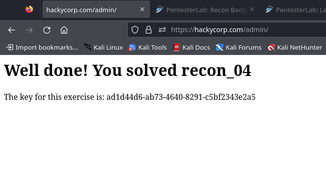

# Recon 04

## This exercise covers common interesting directories

## Objective

### For this challenge, your goal is to find a directory that is commonly used to manage applications.

## Interesting directories

### When accessing a new webserver, it often pays off to manually check for some directories before starting to brute force using a tool. For example, you can manually check for /admin/.

## Solution:

### So I used dirb to perform directory listing

***
    ┌──(hombresito㉿dope)-[~]
    └─$ dirb http://hackycorp.com 

        -----------------
        DIRB v2.22    
        By The Dark Raver
        -----------------

        START_TIME: Fri Apr 19 05:32:42 2024
        URL_BASE: http://hackycorp.com/
        WORDLIST_FILES: /usr/share/dirb/wordlists/common.txt

        -----------------

        GENERATED WORDS: 4612                                                          

        ---- Scanning URL: http://hackycorp.com/ ----
        ==> DIRECTORY: http://hackycorp.com/admin/                                                                                                                           
        ==> DIRECTORY: http://hackycorp.com/images/                                                                                                                          
        + http://hackycorp.com/index.html (CODE:200|SIZE:16011)                                                                                                              
        + http://hackycorp.com/robots.txt (CODE:200|SIZE:121)                                                                                                                
        ==> DIRECTORY: http://hackycorp.com/startpage/                                                                                                   
                                                                                                                                                                        
    ┌──(hombresito㉿dope)-[~]
    └─$ curl http://hackycorp.com/admin     
        <html>
        <head><title>301 Moved Permanently</title></head>
        <body bgcolor="white">
        
<h1>301 Moved Permanently</h1>

        

nginx

        </body>
        </html>

***

### But upon visiting the page as suggested from instructions, I found the flag
